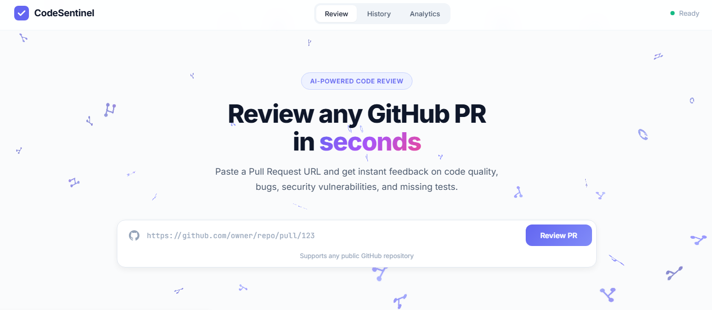
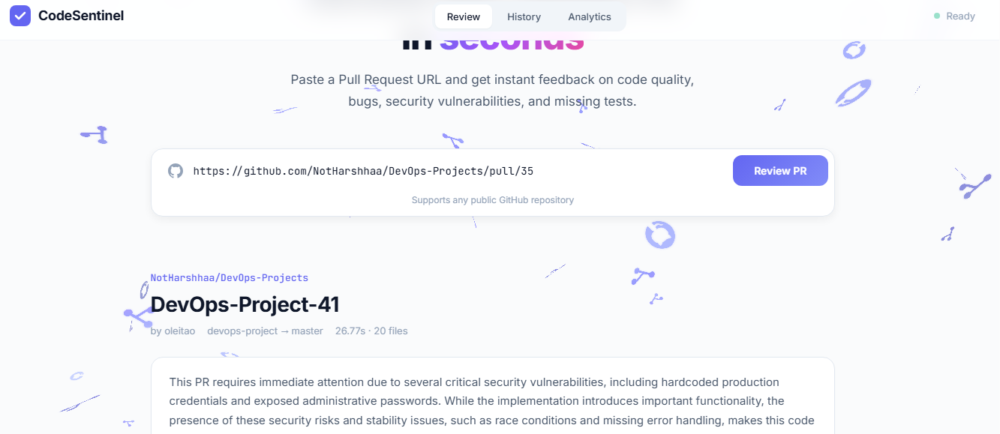
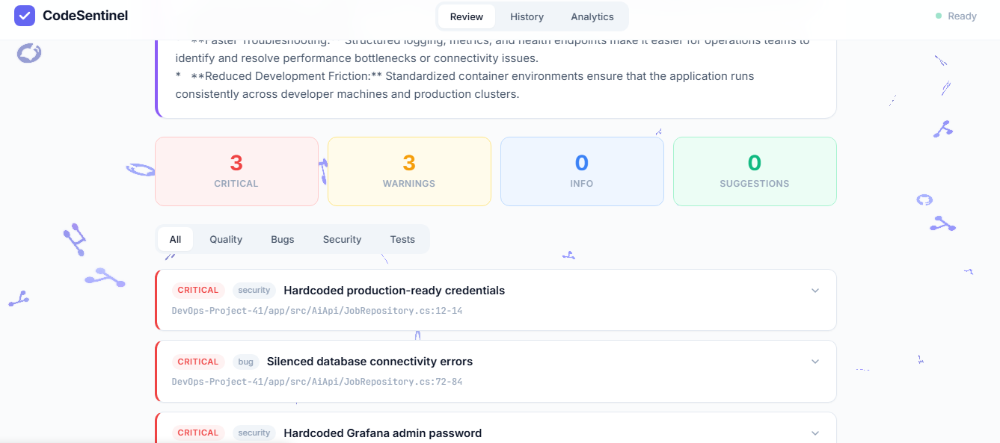
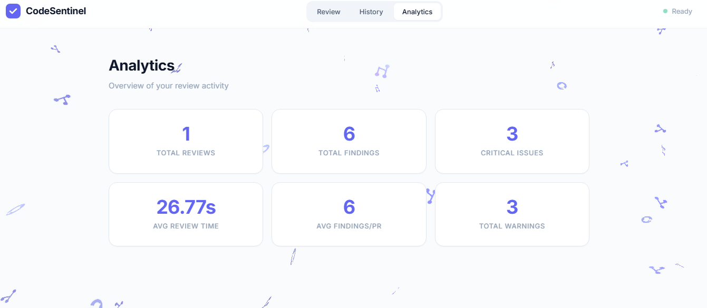
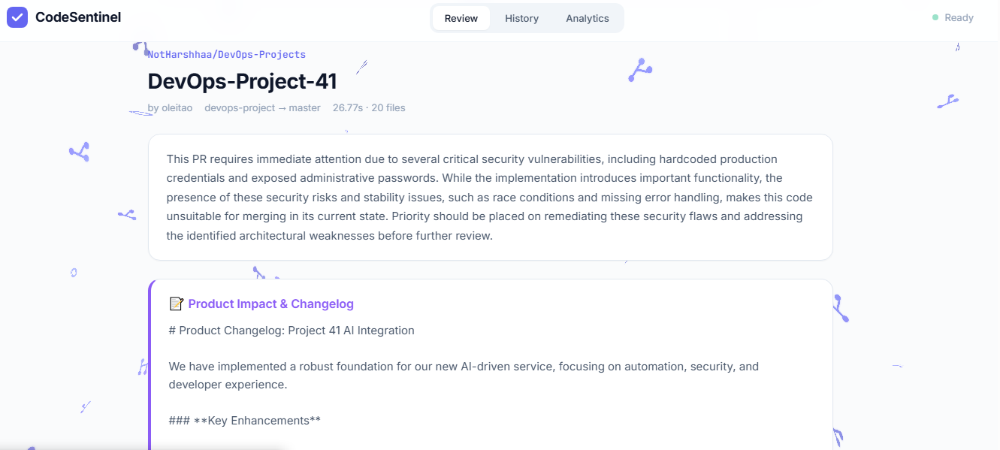
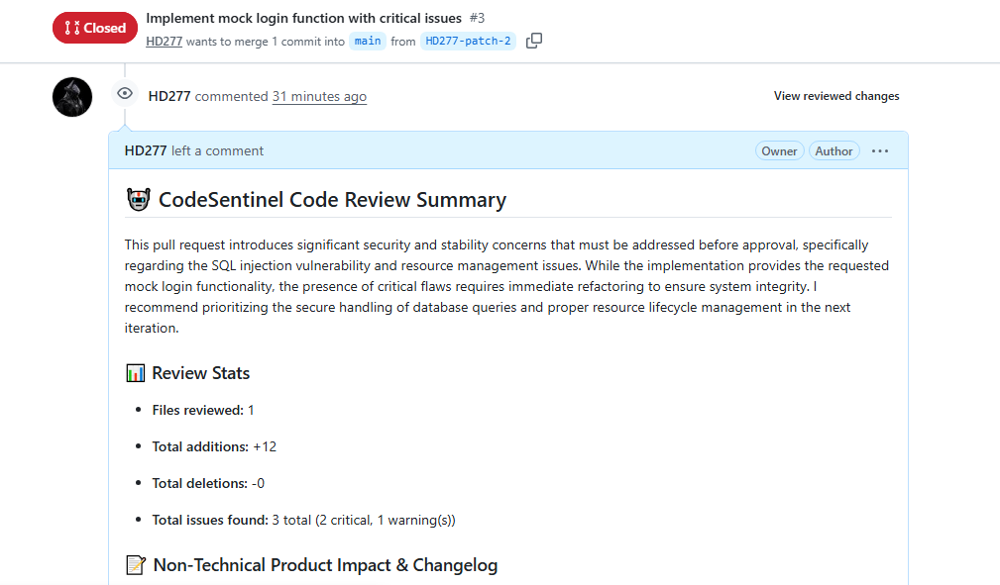
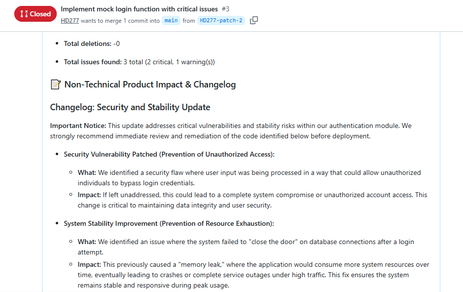
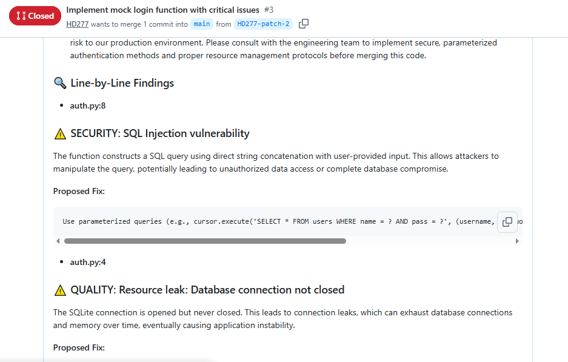

# CodeSentinel — AI-Powered GitHub PR Review Agent

> Paste any GitHub PR link. Get instant, expert-level code review in seconds.

CodeSentinel is a self-hosted AI agent that reviews GitHub Pull Requests automatically. It operates in **two independent modes** — as a passive web tool you can use instantly on any public repository, or as an always-on autonomous agent wired directly into your GitHub repository via webhooks.

Powered by Google Gemini, it runs a structured multi-stage analysis pipeline: code quality, bug detection, security vulnerabilities, and test coverage gaps — then filters false positives with a self-correction step and generates a plain-English product changelog for non-technical stakeholders.

---

## How It Works

```
GitHub PR ──► CodeSentinel
                  │
          ┌───────┴───────┐
          │  Multi-Stage  │
          │   Pipeline    │
          │               │
          │ 1. Quality    │
          │ 2. Bugs       │
          │ 3. Security   │
          │ 4. Tests      │
          │               │
          │  Critic Pass  │  ← filters false positives
          │  Changelog    │  ← plain-English summary
          └───────┬───────┘
                  │
        ┌─────────┴─────────┐
        │                   │
   Web Dashboard      GitHub PR
   (findings UI)    (inline comments
                   + review summary)
```

---

## Two Ways to Use CodeSentinel

### Mode 1 — Web Dashboard (Works on Any Public Repository)

No setup needed beyond running the server. Open the dashboard, paste any public GitHub PR URL, and hit **Review PR**. Within ~30 seconds you get a full breakdown: severity-tagged findings, file-by-file analysis, product impact notes, and review stats.

This works on **any** public GitHub repository — your own projects, open-source libraries, or anything you want to audit.

### Mode 2 — GitHub Webhook Agent (Always-On for Your Repository)

Connect CodeSentinel to your own GitHub repo via a webhook. Every time a Pull Request is opened or a new commit is pushed, CodeSentinel automatically:
1. Pulls the diff from GitHub
2. Runs the full analysis pipeline in the background
3. Posts a review directly onto the PR — inline line-by-line comments plus a full summary with product changelog

Your team gets AI-assisted code review on every PR without lifting a finger.

---

## Screenshots

### Landing Page — Paste Any PR URL

*The dashboard hero. Paste any public GitHub PR URL and hit Review PR. No auth required for public repos.*

---

### Web Review — AI Analysis Results

*After analysis, CodeSentinel displays a structured review summary with a product-impact changelog written in plain English — useful for PMs, QA, and support teams.*

---

### Findings Breakdown — Severity-Tagged Issues

*All findings are tagged by severity (Critical / Warning / Info) and category (Security / Bug / Quality / Tests). Each card is expandable with the full AI explanation.*

---

### Analytics Dashboard

*The Analytics tab tracks your total reviews, findings count, critical issue rate, and average review time across all sessions.*

---

### Web Mode — Any Public Repo Works

*Reviewing a public DevOps repository PR directly from the web dashboard — no webhook or GitHub connection required.*

---

### Webhook Mode — Review Posted Directly to GitHub PR

*When operating as a webhook agent, CodeSentinel posts a full review comment directly on the GitHub PR — including stats, severity breakdown, and the AI summary.*

---

### Webhook Mode — Non-Technical Changelog on GitHub

*The Non-Technical Product Impact Changelog section translates code changes into business language — what changed, what the security risk is, and what the user impact would be.*

---

### Webhook Mode — Inline Line-by-Line Findings

*Each finding is associated to the exact file and line number. CodeSentinel identifies the issue, explains the risk, and provides a concrete proposed fix.*

---

## Features

| Feature | Description |
|---|---|
| **Multi-Stage Pipeline** | Independent analysis steps for Quality, Bugs, Security, and Tests run in sequence |
| **Self-Correction Critic** | A validation pass removes false positives, corrects line numbers, and refines code suggestions |
| **Product Changelog Generator** | Translates code diffs into plain-English release notes for non-technical stakeholders |
| **GitHub Webhook Integration** | Posts inline review comments directly onto PRs automatically when code is pushed |
| **Web Dashboard** | Instant review of any public GitHub PR via the browser UI |
| **Review History** | All past reviews are saved locally in SQLite and browsable in the History tab |
| **Analytics** | Track review volume, critical issue rate, and average review time |
| **Evaluation Harness** | Run `run_eval.py` against a golden dataset to measure Precision, Recall, and detect regressions |
| **Dockerized & Deployable** | One-click deploy to Render, Railway, or any Docker-compatible host |

---

## Project Structure

```
├── backend/
│   ├── agent/
│   │   ├── steps/
│   │   │   ├── quality.py          # Code quality analysis step
│   │   │   ├── bugs.py             # Bug detection step
│   │   │   ├── security.py         # Security vulnerability scan step
│   │   │   ├── test_suggestions.py # Missing test coverage step
│   │   │   ├── critic.py           # Self-correction & false-positive filter
│   │   │   └── changelog.py        # Plain-English changelog generator
│   │   ├── pipeline.py             # Orchestrates all pipeline steps
│   │   ├── llm.py                  # Gemini API wrapper with token tracking
│   │   └── prompts.py              # Structured prompts for each analysis step
│   ├── eval/
│   │   ├── dataset.py              # Golden test cases with known issues
│   │   ├── run_eval.py             # Evaluation harness (Precision/Recall/Latency)
│   │   ├── baseline.json           # Baseline metrics for regression detection
│   │   └── reports/                # Auto-generated evaluation reports
│   ├── api.py                      # FastAPI routes + GitHub webhook receiver
│   ├── config.py                   # Environment variable configuration
│   ├── database.py                 # SQLite async database layer (aiosqlite)
│   ├── diff_parser.py              # Git patch parser (filters lock files, binaries)
│   ├── github_client.py            # GitHub REST API client + PR comment poster
│   └── models.py                   # Pydantic data schemas
├── frontend/
│   ├── index.html                  # Single-page dashboard app
│   ├── styles.css                  # UI styles
│   └── app.js                      # Dashboard logic + Three.js background animation
├── assets/                         # Screenshots for README
├── data/                           # Auto-created directory for SQLite database
├── main.py                         # Application entrypoint
├── render.yaml                     # Render deployment blueprint
└── Dockerfile                      # Container definition
```

---

## Getting Started

### Prerequisites

- Python 3.9+
- A **Gemini API key** — get one free at [Google AI Studio](https://aistudio.google.com/app/apikey)
- A **GitHub Personal Access Token** (optional — needed only for webhook mode to post comments)

### 1. Clone and Configure

```bash
git clone https://github.com/your-username/codesentinel.git
cd codesentinel
```

Copy the environment template and fill in your keys:

```bash
cp .env.example .env
```

Open `.env`:

```env
GEMINI_API_KEY=your_gemini_api_key_here
GITHUB_TOKEN=your_github_pat_here       # Optional — for webhook comment posting
GEMINI_MODEL=gemini-2.0-flash           # Default model
```

### 2. Install & Run Locally

```bash
# Create a virtual environment
python -m venv venv

# Activate it
.\venv\Scripts\Activate      # Windows (PowerShell)
source venv/bin/activate      # macOS / Linux

# Install dependencies
pip install -r requirements.txt

# Start the server
python main.py
```

Open **http://localhost:8000** in your browser.

### 3. Run with Docker

```bash
docker build -t codesentinel .
docker run -p 8000:8000 --env-file .env codesentinel
```

---

## Using the Web Dashboard (Mode 1)

1. Open **http://localhost:8000**
2. In the **Review** tab, paste any GitHub PR URL into the input field:
   ```
   https://github.com/owner/repo/pull/123
   ```
3. Click **Review PR**
4. Within ~15–45 seconds, your results appear:
   - **Summary**: High-level verdict from the AI
   - **Product Impact & Changelog**: Plain-English notes for non-technical readers
   - **Severity counters**: Critical / Warnings / Info counts
   - **Findings list**: Each issue with file path, line reference, explanation, and a proposed fix
5. Switch to the **History** tab to browse past reviews
6. Switch to the **Analytics** tab to see aggregate stats

> **Works on any public GitHub repository.** Just paste the PR URL — no configuration needed beyond your Gemini API key.

---

## Setting Up the Webhook Agent (Mode 2)

This mode makes CodeSentinel an always-on AI reviewer that automatically comments on every PR in your repository.

### Step 1 — Deploy CodeSentinel (it must be publicly reachable)

Follow the [Deployment section](#deployment-to-production) to host it on Render, or use [ngrok](https://ngrok.com) to expose your local server for testing:

```bash
ngrok http 8000
# Note the forwarding URL, e.g.: https://abc123.ngrok-free.app
```

### Step 2 — Ensure your GitHub Token has the right permissions

Your `GITHUB_TOKEN` in `.env` must be a Personal Access Token with:
- **`repo`** scope (for private repos), or
- **`public_repo`** scope (for public repos only)
- Specifically, `pull_requests: write` permission

### Step 3 — Add the Webhook to Your GitHub Repository

1. Go to your GitHub repository → **Settings** → **Webhooks** → **Add webhook**
2. Set the fields as follows:

   | Field | Value |
   |---|---|
   | **Payload URL** | `https://your-domain.com/api/webhook/github` |
   | **Content type** | `application/json` |
   | **Which events** | Select **Let me select individual events**, check **Pull requests** only |

3. Click **Add webhook**

### Step 4 — Open a Pull Request

Create or update a PR in that repository. Within seconds, CodeSentinel will:
- Detect the `pull_request` event via the webhook
- Run the full analysis pipeline in a background task
- Post a review on the PR with:
  - An overall summary comment with stats and severity breakdown
  - A **Non-Technical Product Impact & Changelog** section
  - **Line-by-line findings** linked to exact file paths and line numbers
  - A `REQUEST_CHANGES` review event if critical issues are found

> You can connect **multiple repositories** to a single running CodeSentinel instance by adding the webhook URL to each repo's settings.

---

## Automated Evaluation & Regression Testing

CodeSentinel ships with a benchmarking harness to measure the quality of its own analysis and detect regressions before you deploy updates.

```bash
python -m backend.eval.run_eval
```

The harness:
1. Runs the full review pipeline against a **golden dataset** of code changes with known bugs, security issues, and quality violations
2. Computes **Precision** (using LLM-as-a-judge), **Recall** (against expected findings), **JSON success rate**, and **latency/token metrics**
3. Compares results against `backend/eval/baseline.json` — if performance degrades, it exits with a non-zero code (suitable for CI/CD gates)
4. Saves a full Markdown report and JSON trace in `backend/eval/reports/`

---

## Deployment to Production

CodeSentinel is fully Dockerized and ships with a `render.yaml` blueprint for one-click deployment.

### Deploy to Render (Recommended — Free Tier Available)

1. Create an account at [render.com](https://render.com)
2. Click **New → Blueprint**
3. Connect your forked repository
4. Render reads `render.yaml` automatically — just fill in your environment variables:
   - `GEMINI_API_KEY`
   - `GITHUB_TOKEN`
5. Click **Deploy**

The blueprint mounts a persistent disk at `/app/data` so your review history survives restarts.

Your public URL (e.g. `https://codesentinel-xxxx.onrender.com`) is what you'll use as the webhook Payload URL.

### Deploy with Docker (Any VPS / Cloud)

```bash
docker build -t codesentinel .
docker run -d -p 8000:8000 --env-file .env --restart always codesentinel
```

---

## Tech Stack

| Layer | Technology |
|---|---|
| **AI / LLM** | Google Gemini (via `google-generativeai`) |
| **Backend** | Python, FastAPI, asyncio |
| **Database** | SQLite via `aiosqlite` |
| **GitHub Integration** | GitHub REST API v3 (`httpx`) |
| **Frontend** | Vanilla HTML/CSS/JS + Three.js |
| **Container** | Docker |
| **Deployment** | Render / Any Docker host |

---

## License

MIT
